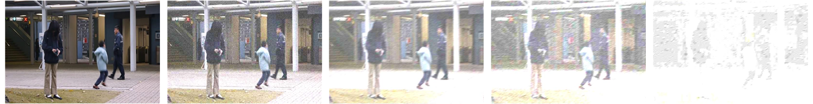
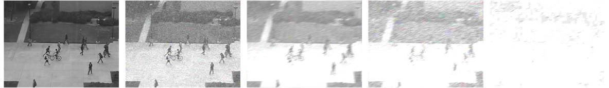
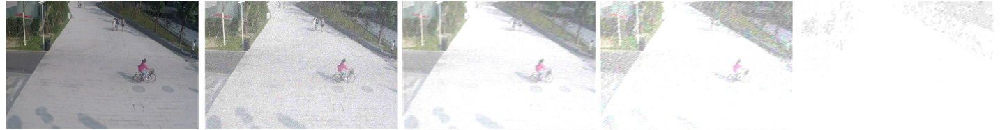

# MultipleDistortionDataset
Multiple-Distortion-Dataset used for VAD
---
## 
| Dataset           | Download Link                                             |
|-------------------|---------------------------------------------------------- |
| DART_Avenue       | [Link1] https://pan.baidu.com/s/1hXNpPzBF8Z40YzjSIeBRew   |
| DART_Ped2         | [Link2] https://pan.baidu.com/s/1aQiH7cpbjN76BpdqoBZZiA   |
| DART_SHANGHAITECH | Ongoing                                                   |

Password:dart

## Data Preview

**DART_Avenue**

**DART_Ped2**

**DART_SHANGHAITECH**

---
## Data Source

This is a custom dataset based on Avenue, Ped2, and ShanghaiTech Campus. We applied distortion to the original datasets to create a new dataset for research and development purposes.
The relevant paper is as follows:

**Avenue**
C. Lu, J. Shi, J. Jia, Abnormal event detection at 150 fps in matlab, in: Proceedings of the IEEE international conference on computer vision, 2013, pp. 2720–2727.

**Ped2**
W. Li, V. Mahadevan, N. Vasconcelos, Anomaly detection and localization in crowded scenes, IEEE transactions on pattern analysis and machine intelligence 36 (2013) 18–32. 

**SHANGHAITECH**
WenLiu, Weixin Luo, Dongze Lian, and Shenghua Gao. Fu ture frame prediction for anomaly detection–a new baseline. In Proceedings of the IEEE conference on computer vision and pattern recognition, pages 6536–6545, 2018. 2, 5, 
